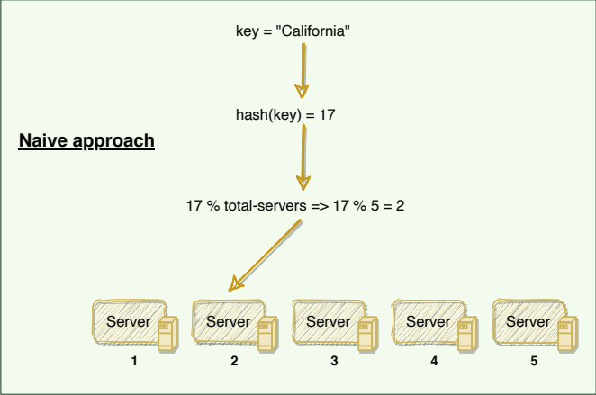
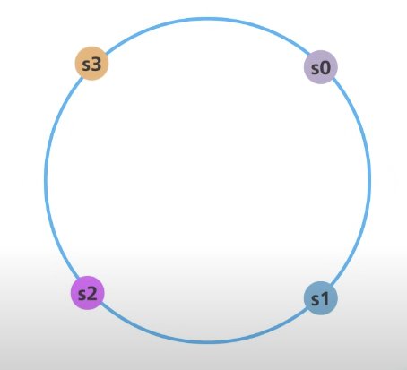
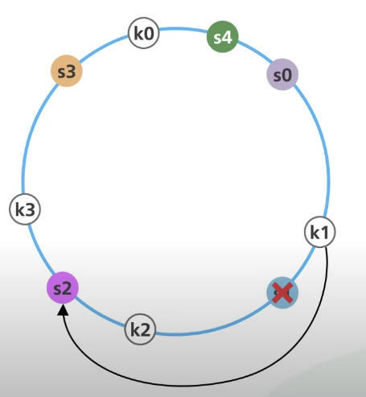
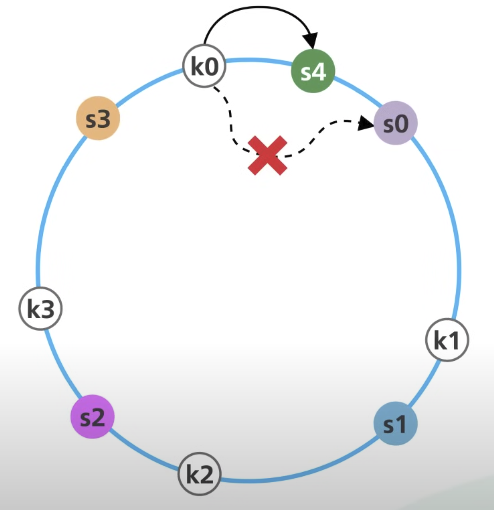
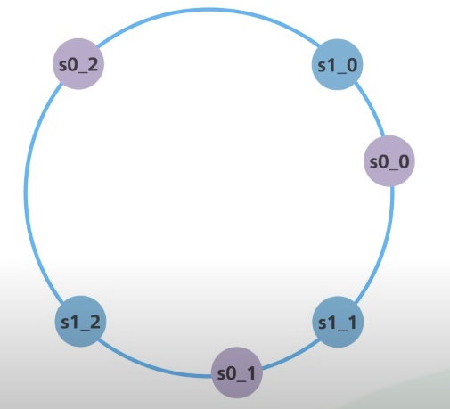

Using the ByteByteGo as the reference: https://www.youtube.com/watch?v=UF9Iqmg94tk

Use Case: mapping keys for a kv service. This service contains server cluster. 

First let's understand simple hashing to outline the challenges.

## Simple Hashing
---

In Simple hashing, we use a hash function which hashes the key to a particular service. In this case we need to use the number of servers to define the location of key. 
In other words, we say each server contains the range of keys.

Few challenges which might come up:
- Hotspot servers
    - read for a particular key
    - writes are mostly going to a particular server
- In case of increase and decrease of servers, each server will be impacted with the keys movement
- Node rebuilding will add load on the server containing the replica

## Consistent Hashing
---
We use the hashing space from the hash fucntion and imagine a circle like this:

x0: start of hashing space, xn: end of hashing space

We use the hash functions to map our servers(using some information of the server, e.g. server name or IP) to points on this circle.

Now we can map our keys on this circle, the keys can go anywhere in the circle and we use clockwise direction to find the target server for the particular key.

This is the idea behind consistent hashing.

### Removing a server

Removing a server results in moving the dead servers keys to the next server.

### Adding a server

Adding a server results in movng some of the s0's key yo s4.

### What about the hotspots?
This is the problem with the assumption that the servers are disctributed evenly on the ring, even if they are, adding or removing will make the distribution uneven. This problem is solved using virtual nodes.

To cater this, we introduce virtual nodes on the ring, in general there are many viartual nodes for a server that makes the distribution even and help us with the hotspots.

### Dealing with Simple Hashing Challenges

- Hotspot servers
    - read for a particular key
    - writes are mostly going to a particular server

Sol: As we have tried to distribute the keys to servers present in the cluster, hostspot's effect can be minimzed to huge extent.

- In case of increase and decrease of servers, each server will be impacted with the keys movement

Sol: this is handled smoothly as explained above.

- Node rebuilding will add load on the server containing the replica

Sol: As the keys are disctributed, not all the keys belonging to a particular server is stored in one node instead across nodes.

### Advantages of consistent hashing
---
- Scaling is each as adding the nodes is easier
- Even distribution on keys results in even load on servers
- Fault tolerance is better as node failure can be handled more easily
    - also, node rebuilding is simpler  

### Trade offs of consistent hashing
---
- Adding viatual nodes make the data distribution even but also makes things more complex
- Data placement: we don't know which node contains the data
- the overhead of partitioning data and maintaining consistent hashing metadata (such as virtual nodes) can increase the memory and computational footprint.